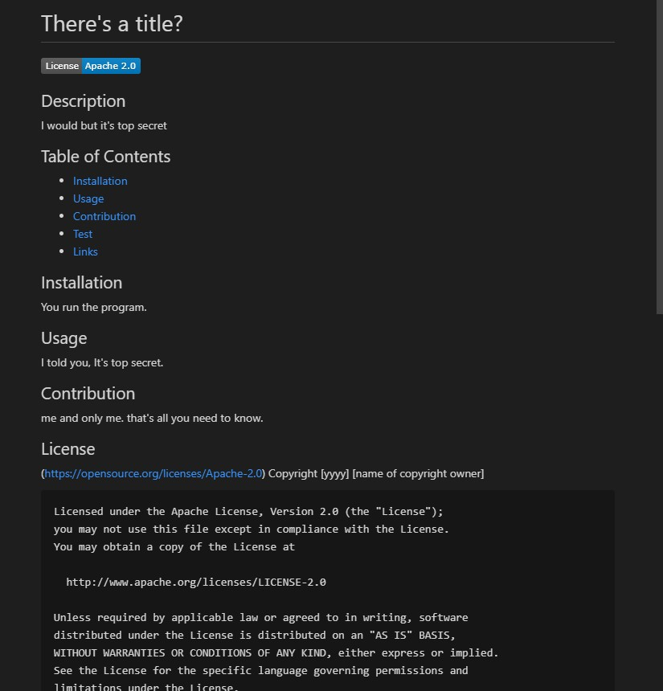

# README-Generator
This program was created to generate a readme. When the user opens the command line they will be asked questions such as what is the title of the project, give a description, how will you install the project, a summary about the project, how to test the code, who contributed to your project, which license you use, your github username and email.

## Video Link

https://drive.google.com/file/d/1DMmilFhmAzFuHqNMJM7661JPrk8QjfaI/view

## Images

